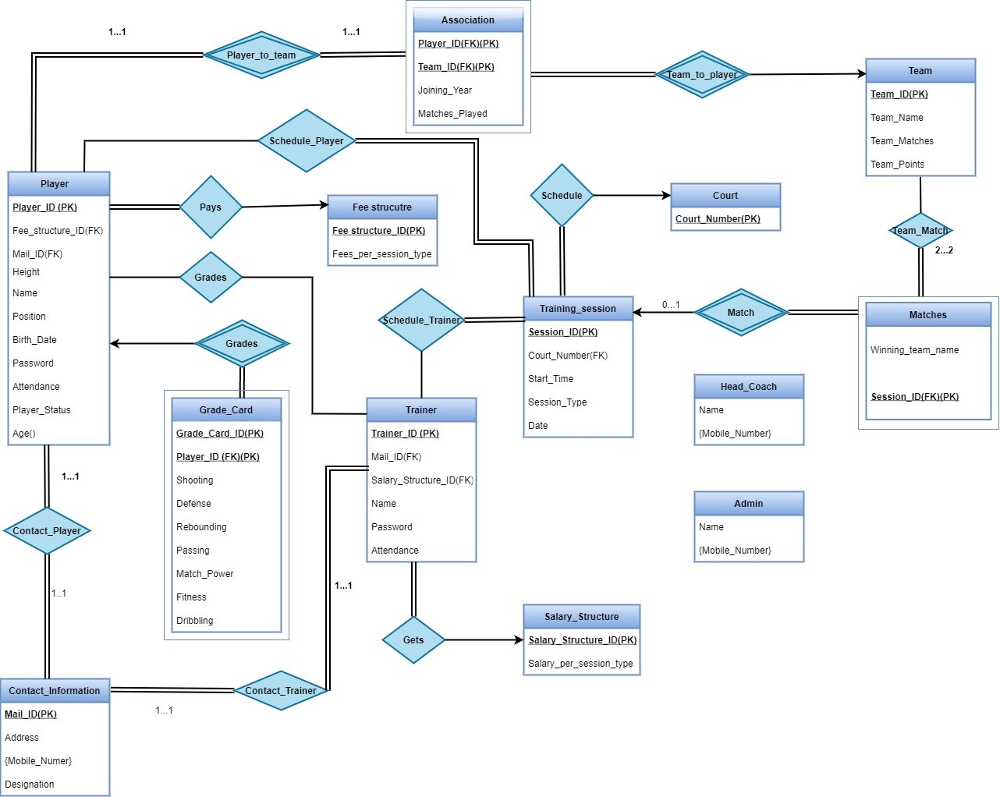

# Basketball-Training-Management-Centre
Repository contains DDL Scripts and triggers for Database and Front End developed for querying database. Front End is developed in Python using PyWebIO library. Sample Dataset is also uploaded for reference purpose.

## Relational Diagram of Database

## Link to Demo Video: [Basketball Training Management Centre, November 2021](https://drive.google.com/file/d/1BYfrmYNlBAhQSBRKarTjK4x7IfyxvWiP/view?usp=sharing)

## Screenshots

